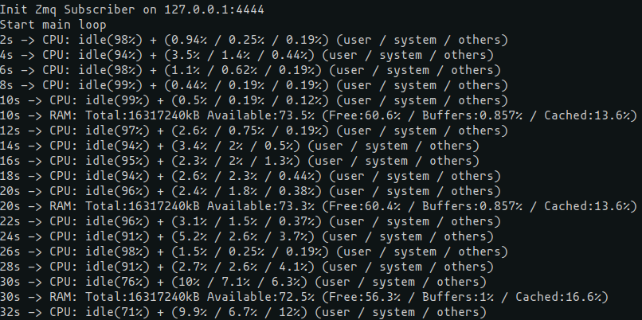
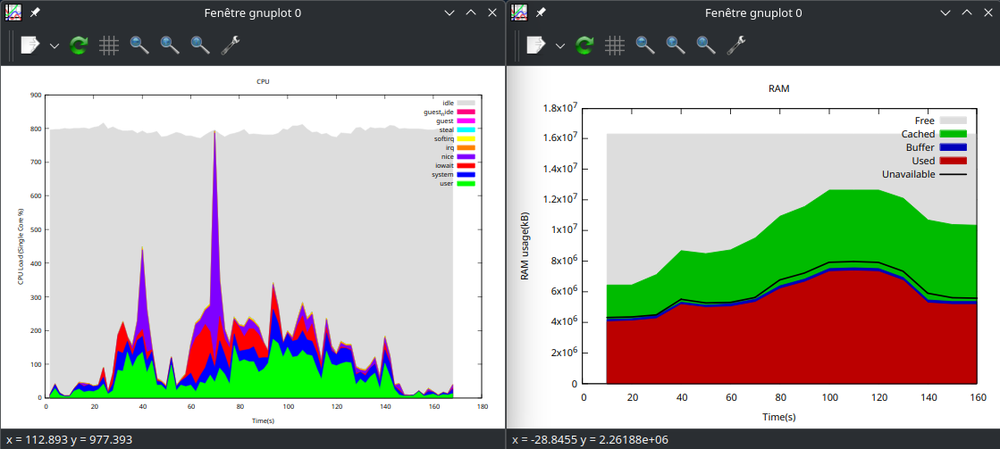

# Technical Test (client-server for metrics)

## Description

Provide a client-server software that delivers some key metrics about the host. You can choose 2-3 metrics you find the most relevant
(e.g.: CPU, RAM, ...).
### Features
1. Server: reads the metrics
2. Server: publish the metrics on the network
3. Client: connects to the server and reads the information published (CLI interface or logging)
NB: The implementation of the feature 3 is optional. We’re more interested in how you plan to implement it.
### Requirements
 - Client and server should be implemented with C++ (>= 17) and cmake
 - Select the techno for the interprocess communication and explain your choice
 - The program shall remain simple, but should be functional. Add the documentation you find necessary.
### Delivery
 - The project sources should be delivered by zip or accessible through a git repository.


## Tools and dependencies
 - C++ 20
 - Cmake >= 3.28
 - lib zmq 3.x (eg: package libzmq3-dev)
 - gnuplot on client side (optional)


## Build instructions

```
mkdir build
cd build
cmake ..
make install
```
server and client binary will be installed in /install/bin


## Usage instructions

### Start applications
Simply start server binary on the server and client binary on the client
2 arguments are available (optional) for both applications:
```
-i IP   # default 127.0.0.1
-p port # default 4444
```

### Display metrics
On client side there is 3 ways to check data received from server:
- Directly in standart output, some basic metrics will be logged
- 2 csv files will be generated localy (RAM.csv and CPU.csv)
- With gnuplot tool (to be installed on client), 2 scripts are available in /gnuplot.
    It is possible with these scripts to display a real time chart during client execution.
```
# From client directory with csv files:
gnuplot -p ../gnuplot/CPU.gnuplot # use path to gnuplot script
gnuplot -p ../gnuplot/RAM.gnuplot
```


### Output


